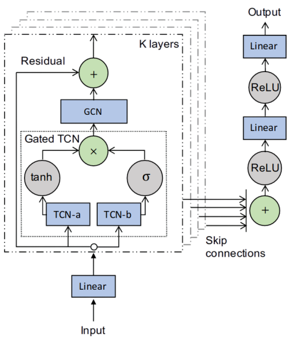

# 论文笔记——流量预测

> [!NOTE]
>
> Ctrl + Enter：表格添加一行
>
> Shift + Enter：表格内部换行，相当于末尾加\br

## 论文总结

### Graph WaveNet

> 2019年，IJCAI，Graph WaveNet for Deep Spatial-Temporal Graph Modeling，交通流量预测

#### 优势及创新点

1. 基于实体之间的关系都是预定的（实际上不是），仅通过固定图结构捕获空间依赖 $\rightarrow$ 使用**自适应邻接矩阵**，动态调整图结构 。通过两个可学习的向量实现，对应公式（5）。
2. 无法有效捕获长时间序列 $\rightarrow$空洞卷积扩大感受野，模拟RNN、LSTM捕获长序列特征，同时拥有**并行运算**的特性。
3. GCN考虑二阶邻居，即邻居的邻居。
4. 模型训练/推理速度非常快。

#### 不足

1. **大规模数据集**上应用Graph WaveNet的可拓展方法 。
2. 进一步学习**动态**空间依赖。

#### 代码复现

##### 技巧

1. 采用残差块，避免梯度消失。
2. 尽可能采用**卷积层代替其他层**，如线性层（也叫全连接层）、skip connection等。减少模型参数，提高模型训练速度。
3. 善用**一维卷积**。一维卷积不能改变张量的高宽，但能改变其通道数。
4. 增加通道数：确保特征表示的丰富性，可以学习到更加复杂的特征。
5. skip connection
   - 特征累积：每一个中间层的特征都会对最终结果产生影响，提高模型的表现能力和训练稳定性。
   - 缓解梯度消失。
6. 门控机制
   - tanh：[-1, 1]，提供实际的特征信息。
   - sigmoid：[0, 1]，控制信息通过的程度。
   - `filter * gate`，即对应位置元素相乘：filter 中的每个值都会根据 gate 的值进行调制（也就是有选择性地放大或抑制）。

##### 结果对比

> 以下结果基于METR-LA数据集，时间范围为60min。

|      | MAE$\downarrow$ | RMSE$\downarrow$ | MAPE$\downarrow$ |
| :--: | :-------------: | :--------------: | :--------------: |
| 论文 |      3.53       |       7.37       |      10.01%      |
| 复现 |     3.0882      |      6.1751      |      8.23%       |

$\downarrow$ 表示值越低，效果越好。

## 评价指标

> [!NOTE]
>
> $\hat{y_i}$表示预测值，$y_i$表示真实值。

- MAE（平均绝对误差 ）：mean absolute error。描述预测值与真实值之间的平均误差，**单位一致**。$MAE = \frac{1}{n}\sum_{i = 1}^n\mid y_i - \hat{y_i}\mid$

- RMSE（均方根误差）：root mean squared error。因为平方之后较大误差会变得更大，所以**惩罚较大误差，强调了极端值的影响**。$RMSE = \sqrt{\frac{1}{n}\sum_{i = 1}^n (y_i - \hat{y_i})^2}$

- MAPE（平均绝对百分比误差）：mean absolute percentage error。描述预测误差相对于真实值的百分比，显示了误差的相对大小。$MAPE = \frac{100\%}{n} \sum_{i = 1}^n\mid \frac{y_i - \hat{y_i}}{y_i} \mid$

## 论文阅读方法论

### 心态

不要瞎拼接模型，硬卷分数。**要深入、反复思考该领域有哪些未解决甚至未被发现的痛点，再针对性设计算法。解决方案要更贴合实际，要真的从未来落地方向考虑**。相当于自己开辟新的赛道，在自己的赛道里跟别人比，会大幅减少难度。

### 分析已解决与未解决的问题

1. 论文中直接指出了已解决与未解决的问题。
2. 从研究动机、创新点、使用方法或技术等分析出已经解决的问题，很可能该论文的研究动机、创新点、使用的方法或技术就是为了解决某些问题。
3. 从实验结果、结论部分、未来工作等推断出该论文的不足。
4. 自行分析不足
   - 方法适用性：是否有特定限制？是否适用于所有情景？
   - 实验设计：实验是否足够全面？是否考虑了所有可能的情况？
   - 结果解释：结果是否支持作者的结论？是否有不一致之处？

