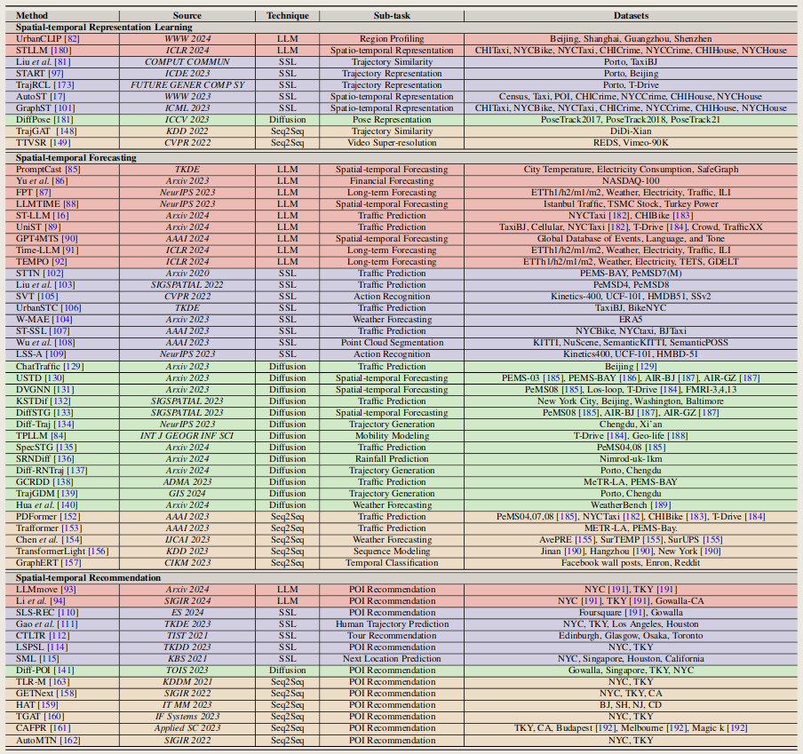
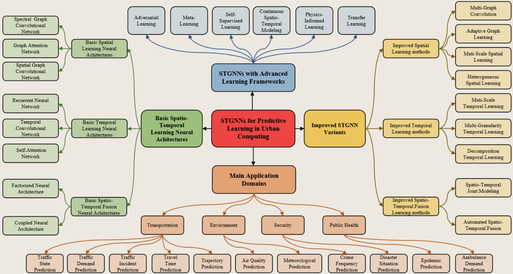
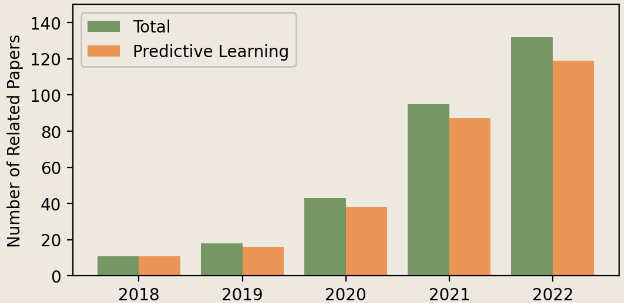
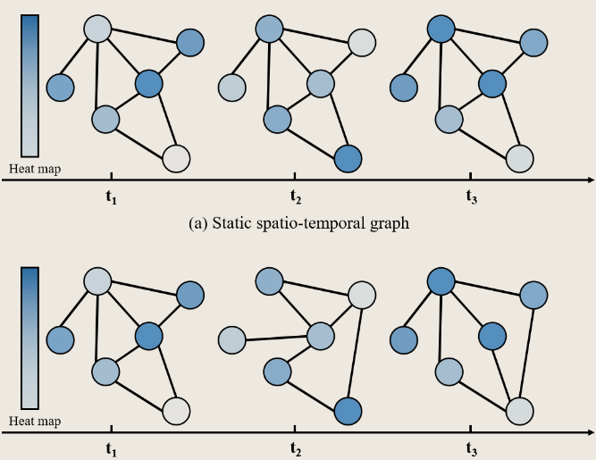
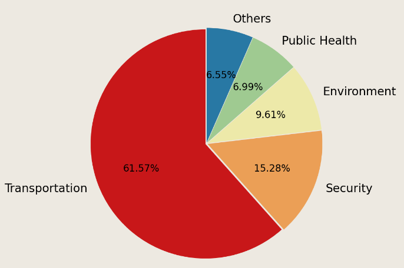
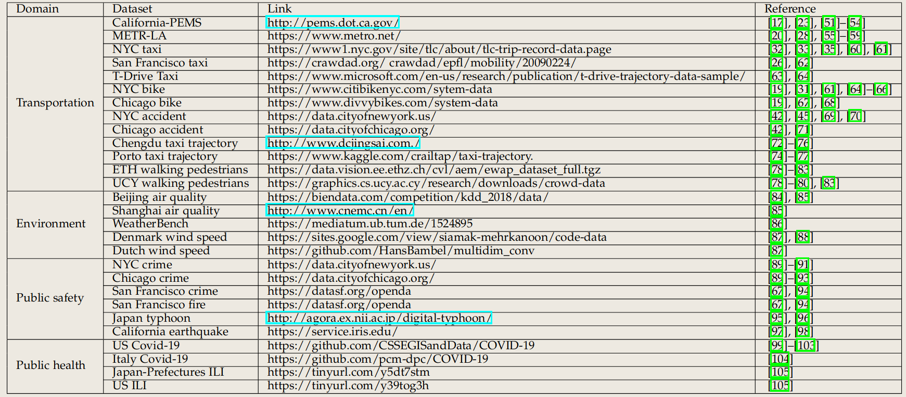

# 时空数据分析论文综述

## 2024——A Survey of Generative Techniques for Spatial-Temporal Data Mining

**适应领域**：城市管理、出租车分派任务、人类健康（？）、天气气候、

**具体方向**：人类轨迹预测、交通流量预测、犯罪预测、天气预测

### 相关工作

1. 基于深度学习模型的或基于GNN方式的时空预测综述
   - G. Jin, Y. Liang, Y. Fang, J. Huang, J. Zhang, and Y. Zheng, “Spatiotemporal graph neural networks for predictive learning in urban computing: A survey,” arXiv preprint arXiv:2303.14483, 2023.
   - X. Luo, C. Zhu, D. Zhang, and Q. Li, “Stg4traffic: A survey and benchmark of spatial-temporal graph neural networks for traffic prediction,” arXiv preprint arXiv:2307.00495, 2023.

2. 包含综述和总览（进行补充），但年份都比较老，最新的都是2018年
3. 时空数据库

### 数据

**数据特性**

1. 空间上的和时间上的两个不同方面的相互联系
2. 空间和时间上的固有的变化，即不同时间，不同地点，存在完全不同的特征、趋势以及时空数据间的交互关系

**数据类型**

1.  event data
2. trajectory data
3. point data
4. raster data

### 未来方向

- 分布不平衡/不均匀的数据集
- 大规模的基础模型（算力达不到）
- 时空方法的泛化
- 与外部知识结合（外挂知识库？）

### 任务应用

## Spatio-Temporal Graph Neural Networks for Predictive Learning in Urban Computing: A Survey

### 总览

关于时空数据的**城市计算**预测领域的论文，逐年增长，占时空数据总论文数的**90%**。STGNN(Spatio-Temporal Graph Neural Network)被广泛应用。

### 时空图的构建

**图的表示**

- V：结点数量，大部分情况下是静态的。
- E：各个时间下的边集。可能是不变的，也可能是随时间变化的。
- A：各个时间下的邻接矩阵。 

**动态图与静态图的区别**：静态图的边集不会随时间，而动态图会。当边集变化的时候，邻接矩阵也会随之而变化。

**图的构建方式**

- 基于拓扑(topology-based)：与数据结构的定义相同，如果两个结点相连，则它们之间存在一条边。
  - $a_{ij}^t = \begin{cases} 1, &\text{if $v_i$ connects to $v_j$  } \\ 0,& otherwise\end{cases}$
- 基于距离(distance-based)：基于假设“距离越近，越相似”
- 基于相似度(similarity-based)：基于时间的相似性或者基于空间的相似性，如POI
- 基于交互(interaction-based)：通过信息流的观点表示结点间的连接。在**移动性特征**中尤为重要。

### 研究领域

**交通方向**的研究是最多的。

- 交通状态预测
- 交通需求预测
- 交通时间预测
- 行程时间预测
- 邻接预测
- 空气质量预测
- 气象预测
- 犯罪频率预测
- 灾害情况预测
- 流行病预测
- 紧急需求预测

### 公共数据集

### 挑战和未来方向

- 缺乏可解释性（深度学习通病）
- 缺乏校准方法
- 缺乏物理约束
- 缺乏预训练技术（算力需求大）
- 数据分配不均
- 可拓展性问题

